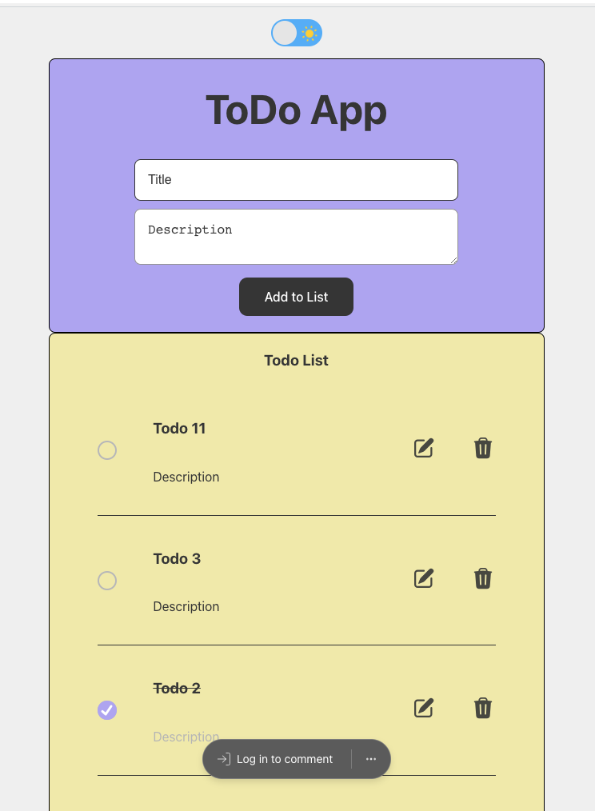

This is a Todo App
- backend is hosted on Vercel as well
- [backend-github-link](https://github.com/Nisha1205092/todoApp)
- MongoDB Atlas is used for the database
- frontend is deployed using the Vercel CLI
    - To deploy via the vercel CLI, first run ```npm run build```
    - Then run ```vercel```
    - This will deploy the frontend on Vercel

